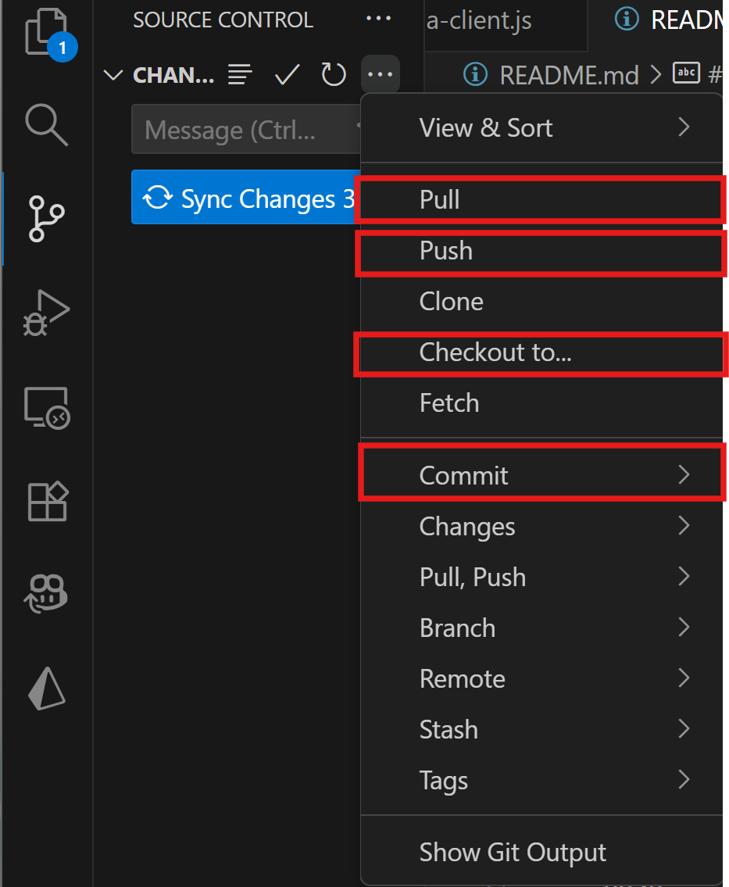
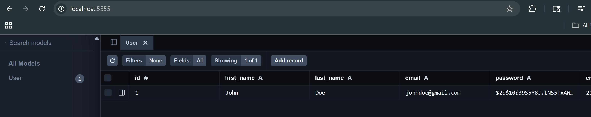

# Red2Green

Red2Green is a web-based application that provides a streamlined, user-friendly profit and loss tracking for stock investors.

## Getting Started (GitHub)

Follow these steps to set up your environment and work on tasks.

### 1. Clone the Repository
First, clone the project locally:
```bash
git clone https://github.com/UFRed2Green/Red2Green.git
cd Red2Green
```

### 2. Work on Tasks
**Create a branch from the Jira subtask assigned to you** (this ensures the Jira issue links properly with your GitHub branch). Otherwise you have to manually type keywords into branch names for them to be linked with Jira.

### 3. Make Changes

Once you've made code changes:

Add files to staging:

```bash 
git add .
```


Commit changes frequently with clear commit messages (following best practices):

```bash 
git commit -m "Add feature X"
```


Push your changes to the remote branch:

```bash 
git push origin <branch-name>
```

Tip: If you prefer, most of these steps (adding, committing, and pushing) can be done more easily through the VS Code UI.



### 4. Create Pull Request
To create the pull request for your changes (for someone to review them) go to the "Pull Requests" tab on GitHub, assign a reviewer, and create it.
Upon review, you can merge the pull request into the master branch.

### Project Structure
```
Red2Green/
├── client/
└── server/
```
| Layer      | Technology |
|-------------|-------------|
| **Frontend** | Next.js, React |
| **Backend**  | Node.js, Express |
| **Database** | Prisma ORM with PostgreSQL (Docker) |

## Getting Started (Project)

### Step 0. Environment Setup
Before running anything, create a copy of the file .env.example within the server directory and call it .env.
```bash
cp .env.example .env
```

In the .env file, set your JWT secret (a random, private string used to sign authentication tokens).
You can generate one like this:
```bash
node -e "console.log(require('crypto').randomBytes(64).toString('hex'))"
```

Copy that value into your .env under:
```bash
JWT_SECRET=<paste_generated_secret_here>
```

### Step 1. Install Dependencies and Start the App 
Pull the latest changes from the repository.

```bash
git pull
```

Install the latest dependencies in the client directory and also in the server directory.
```bash
npm install && npm install concurrently
cd server && npm install && npm install cors
cd ../client && npm install && npm install react-icons
```
**Before proceeding**, follow the instructions in the [**Backend / Server**](#backend--server). Then, run the app with this command from the root directory. This will start the server and client concurrently.

```bash
npm run dev
```

### Frontend / Client
Open [http://localhost:3000](http://localhost:3000) with your browser to see the result.

You can start editing the page by modifying `app/page.tsx`. The page auto-updates as you edit the file.

This project uses [`next/font`](https://nextjs.org/docs/app/building-your-application/optimizing/fonts) to automatically optimize and load [Geist](https://vercel.com/font), a new font family for Vercel.

### Backend / Server

In the server/ directory, run the following commands to set up the backend environment.
These only need to be run during the initial setup or when the database schema changes.
They ensure Prisma, Docker, and PostgreSQL all work together correctly.

1. [Install Docker for desktop](https://www.docker.com/get-started/) and open the app. This is used to run the local PostgreSQL database in a consistent containerized environment.

2. Generate the Prisma client
    (creates the database client from schema.prisma)
    ``` bash
    npx prisma generate
    ```

3. Build Docker containers
(sets up the backend and database environment)
    ```bash
    docker compose build
    ```

4. Apply database migrations
    (initializes the PostgreSQL schema)

    ```bash
    docker compose run app npx prisma migrate dev --name init
    ```

5. Then, return to the project’s root directory and start the app with npm.

Open [http://localhost:5000](http://localhost:5000) with your browser to ensure that the server is running.

See the database

```bash
docker compose exec app npx prisma studio
```


## Learn More

To learn more about Next.js, take a look at the following resources:

- [Next.js Documentation](https://nextjs.org/docs) - learn about Next.js features and API.
- [Learn Next.js](https://nextjs.org/learn) - an interactive Next.js tutorial.
- [Node.js Documentation](https://nodejs.org/docs/latest/api/) - reference for core Node APIs and runtime behavior.
- [Docker Documentation](https://docs.docker.com/) - learn container setup, image building, and deployment basics.
- [Prisma Documentation](https://www.prisma.io/docs) - ORM setup guide, schema modeling, and database workflows.
